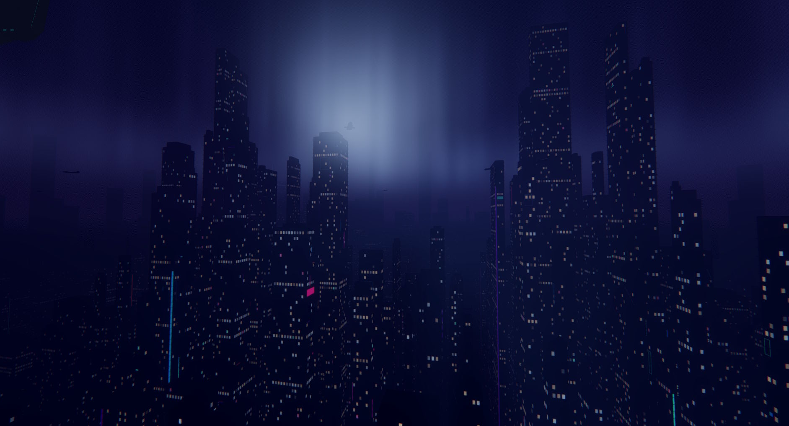

# Nightwalk

A first-person cyberpunk rooftop-exploration game set in an endless procedurally generated night city. Single-player. Built solo in [Godot 4.6](https://godotengine.org/) with C# (.NET 10).



[More screenshots →](docs/screenshots.md)

> Hobby project, still evolving. Expect rough edges and missing content. Bug reports welcome via [Issues](https://github.com/jazzonaut/nightwalk/issues).

## What you do

Rain-slicked rooftops, neon signage, aurora in the sky, lightning over distant skylines. You traverse with walking, running, jumping, a jetpack, and player-placed ziplines. Beacons on tall rooftops emit colored signal beams; you place prisms to route a source beacon's beam to a same-frequency target. Climbing buildings brings the streets below "alive" with animated car trails. Collecting glowing polyhedrons fills the score and grows a combo multiplier.

Two **game modes** layer over the base traversal:

- **Silence** — pure exploration + puzzles. Default.
- **Resonance** — collecting raises an Alert meter, which spawns a Warden, which deploys Seekers that scan for you. Detection drains score. Repel the Warden by holding the beacon beam on its exposed core.

Four **difficulty levels** (`Observer`, `Explorer`, `Wanderer`, `Architect`) scale costs, rewards, damage, and limits, orthogonal to game mode.

## Play it

Pre-built binaries (Windows / Linux / macOS) will appear on the [Releases page](https://github.com/jazzonaut/nightwalk/releases) once the first build is cut. Until then, run from source — see [Build & run](#build--run) below.

## Status

Solo hobby project, no commercial development, no committed roadmap. If you find a bug, [open an issue](https://github.com/jazzonaut/nightwalk/issues/new/choose). Contributions welcome with light guardrails — see [CONTRIBUTING.md](CONTRIBUTING.md).

---

## For developers

### Build & run

Requirements:

- Godot 4.6 with .NET (mono) build.
- .NET 10 SDK.

Open `project.godot` in Godot. Build the C# project (Godot will invoke `dotnet build` on `Nightwalk.csproj`). Run the main scene (`scenes/Main.tscn`).

Configuration lives in `data/*.toml` (nine files). Edit them and re-run; in **DEBUG builds**, file changes hot-reload at runtime — see [ADR-0006](docs/adr/0006-toml-hot-reload.md).

### Project layout

```
.
├── assets/             Runtime assets — music, textures, models
├── data/               TOML configuration (9 files; hot-reloadable in DEBUG)
├── docs/               ADRs + per-system reference + agent guidance
├── scenes/             Godot scenes — Main.tscn, ShaderTest.tscn
├── shaders/            GLSL shaders
└── src/
    ├── Nightwalk.Core/   Pure C# — no Godot dependencies. Testable.
    └── Nightwalk.Godot/  Engine-bound C# — scenes, rendering, input, audio, tools.
```

### Documentation map

- **[CONTEXT.md](CONTEXT.md)** — domain map + glossary. Read this first to learn the vocabulary (Beacon, Prism, Frequency, Sync, Alert, Exposure, Warden, Seeker, Chunk, Cluster, Game Mode, …).
- **[docs/conventions/](docs/conventions/)** — how new code should look. Read before adding or refactoring:
  - [naming.md](docs/conventions/naming.md) — file/folder layout, namespaces, type suffixes (`*Event`, `*Id`, `*Tracker`, `*Setup`/`*Result`, …), member casing, capability-flag naming.
  - [patterns.md](docs/conventions/patterns.md) — recurring code shapes: assembly split, manual DI in `GameRoot`, `*Setup`/`*Result` helpers, `EventBus` lifecycle, state-machine capability flags, config pipeline, session reset, the `null!` field pattern.
- **[docs/adr/](docs/adr/)** — architecture decision records. The "why" behind the codebase shape. Start with [docs/adr/index.md](docs/adr/index.md) for a grouped overview.
- **[docs/systems/](docs/systems/)** — per-system reference: tuning tables, scene/node footprints, integration points, acceptance checklists, code-verified 2026-05.
- **[docs/agents/](docs/agents/)** — instructions for AI/agent collaborators (issue tracker, triage labels, domain doc conventions).

Copyright (C) 2026 jazzonaut.
